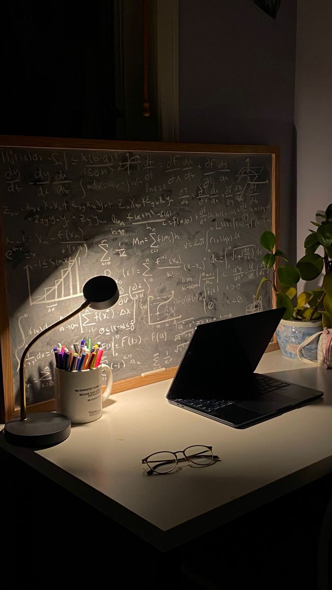

Bem-vindo(a) ao repositório oficial das aulas de Física Computacional voltadas para os cursos de Mestrado e Doutorado em Física da Universidade Federal de Uberlândia (UFU).

Este projeto reúne conteúdos desenvolvidos ao longo das disciplinas oferecidas na pós-graduação, com foco na aplicação de métodos numéricos, simulações e ferramentas computacionais modernas para a resolução de problemas complexos em Física.

  

